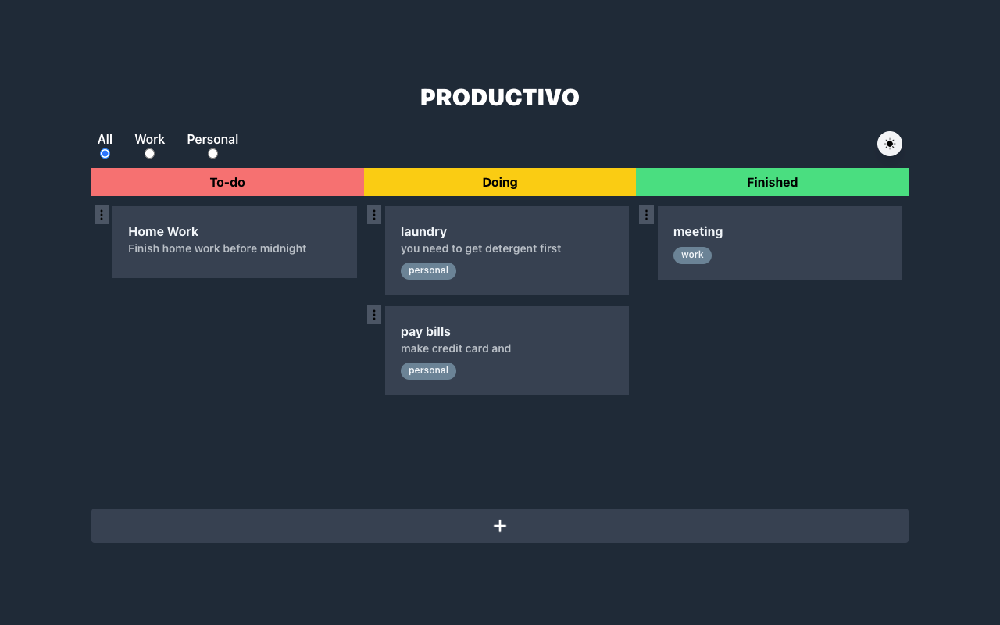

# Productivo 💡



## Details
  A simple todo app, that helps you track between the different stages of your productivity. Currently working on adding filtering, date tracking, as well as, other PWA features.

### Built with
- TypeScript
- React
- Redux
- Tailwind CSS

### Testing
- React Testing Library
- Jest


Bootstrapped with [Create React App](https://github.com/facebook/create-react-app), using the [Redux](https://redux.js.org/) and [Redux Toolkit](https://redux-toolkit.js.org/) template.

### **Available Scripts**

#### **Development Mode**
```sh
npm start
```

#### **Testing**
```
npm test
```

#### **Production Mode**
```
npm run build
```

### Learn More

You can learn more in the [Create React App documentation](https://facebook.github.io/create-react-app/docs/getting-started).

To learn React, check out the [React documentation](https://reactjs.org/).
